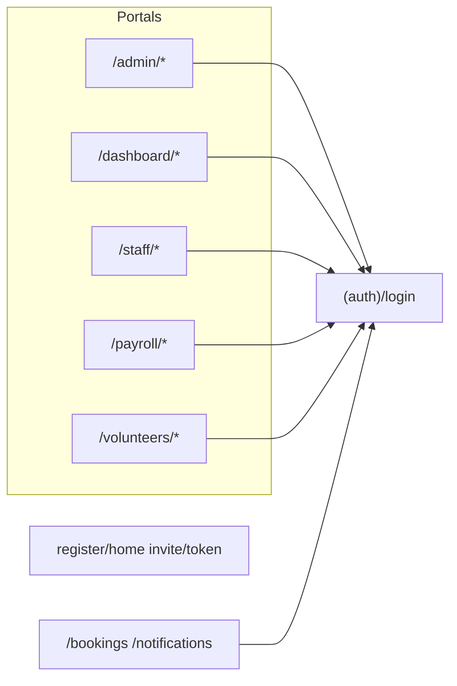

# Codebase: features and architecture

A structured inventory of the Arts & Aging Network app: stack, data model, routes by role, auth, middleware, server actions, and cross-cutting patterns. This document is the **in-repo** companion to the codebase exploration; keep it updated when major subsystems change.

---

## Stack and tooling

| Layer | Choice | Notes |
|-------|--------|--------|
| Framework | Next.js **16.1.1** (App Router), React **19.2** | Dev script: `next dev --webpack` ([package.json](../package.json)) |
| Database | **PostgreSQL** via Prisma **5.22** | [prisma/schema.prisma](../prisma/schema.prisma) |
| Auth | **NextAuth v5** (`next-auth` **5.0.0-beta.30**), Credentials, **JWT** | [auth.ts](../auth.ts), [app/api/auth/[...nextauth]/route.ts](../app/api/auth/[...nextauth]/route.ts) |
| Validation | **Zod** **4.3.x** | Server actions under [app/actions/](../app/actions/) |
| UI | Tailwind 4, `lucide-react`, shared tokens | [lib/styles.ts](../lib/styles.ts); [components/DashboardLayout.tsx](../components/DashboardLayout.tsx) and role-specific layout wrappers |
| Other | TipTap, Leaflet, AWS S3 presign, web-push, xlsx, googleapis; Supabase client in deps | Usage varies by feature |

**Prisma:** Use `npx prisma db push` (or `npm run db:push` with [scripts/with-env.mjs](../scripts/with-env.mjs) loading `.env.local`). If your deployment uses a pooled `DATABASE_URL`, ensure migrations/generate expectations match your datasource config.

**Next.js config:** [next.config.ts](../next.config.ts) sets `outputFileTracingRoot` to the project root to reduce multi-lockfile / chunk tracing issues.

---

## Data model (high level)

The **`User`** model is central: profiles, roles, payroll-related fields, staff onboarding/HR extensions, and relations across the app.

| Domain | Representative models |
|--------|------------------------|
| Identity / access | `User`, `Invitation`, `AuditLog`, `Document`, `UserPrivacy`, `EmailChangeRequest`, `PushSubscription` |
| Homes | `GeriatricHome` (linked to `HOME_ADMIN` user) |
| Bookings | `Event`, `Location`, `Program`, `EventAttendance`, comments/photos/reactions, `EmailReminder` |
| Booking requests | `EventRequest`, `EventRequestResponse`, optional `FormSubmission` link |
| Messaging | `DirectMessage`, `DirectMessageRequest`, `MessageGroup`, `GroupMember`, `GroupMessage`, reactions, stars, templates, reminders, scheduled messages, typing, broadcasts |
| Forms | `FormTemplate`, `FormSubmission`; payroll `PayrollForm`, `PayrollFormSubmission` |
| Payroll / ops | `Timesheet`, `TimesheetEntry`, `TimeEntry`, `WorkLog`, `MileageEntry`, `ExpenseRequest` |
| CRM / inventory | `Donor`, `Donation`, `Testimonial`, `InventoryItem`, `InventoryTransaction` |
| Comms | `Notification`, `MeetingRequest`, `PhoneRequest`, `EmailTemplate` |

See [prisma/schema.prisma](../prisma/schema.prisma) for the full schema.

Note: User-facing terminology is "Booking(s)". Some Prisma/DB model names still use legacy `Event*` naming for compatibility.

---

## Routing and personas

| Persona | Primary `app/` tree | Notes |
|---------|---------------------|--------|
| **ADMIN** | [app/admin/](../app/admin/) | Dashboard, financials, bookings (list/calendar/requests), homes, users (incl. placeholder staff), communication hub, messaging, conversation requests, forms, inventory, donors, testimonials, timesheets, mileage, invitations, audits, settings, broadcasts, imports, payroll forms, etc. |
| **HOME_ADMIN** | [app/dashboard/](../app/dashboard/) | Home portal: bookings, requests, forms, my bookings, history, contacts, profile, settings. `/dashboard/calendar` redirects to `/dashboard/bookings`. `/dashboard/engagement` exists but is not in the default sidebar menu ([lib/menu.ts](../lib/menu.ts)). |
| **Staff-style roles** | [app/staff/](../app/staff/) | **FACILITATOR**, **BOARD**, **PARTNER**, **PAYROLL** (middleware); **VOLUNTEER** may also use `/staff` for inbox/groups per [middleware.ts](../middleware.ts). Inbox, groups, bookings, directory, forms, profile, onboarding at `/staff/onboarding`. |
| **PAYROLL** | [app/payroll/](../app/payroll/) | Check-in, timesheet, mileage, forms, requests, history, schedule, profile. |
| **VOLUNTEER** (dedicated shell) | [app/volunteers/](../app/volunteers/) | Dashboard + forms; menu may reference routes—verify [lib/menu.ts](../lib/menu.ts) matches implemented pages. |
| **Shared (authenticated)** | [app/bookings/](../app/bookings/), [app/notifications/](../app/notifications/) | Booking browsing/detail; notification center. |
| **Public / pre-auth** | [app/register/home/](../app/register/home/), [app/invite/[token]/](../app/invite/[token]/), [app/(auth)/login/](../app/(auth)/login/) | Registration and login flows. |

**Navigation:** [lib/menu.ts](../lib/menu.ts) (`adminMenu`, `homeAdminMenu`, `staffMenu`, `volunteerMenu`, `boardMenu`, `MENU_ITEMS`) consumed by [components/DashboardLayoutClient.tsx](../components/DashboardLayoutClient.tsx).

**Redirect-only admin URLs (aliases):** `/admin/form-templates` → forms tab; `/admin/timesheets` → financials; `/admin/booking-requests` → booking requests tab. Safe for bookmarks; prefer canonical URLs in new links.

---

## Auth, roles, and route protection

- **Roles:** [lib/roles.ts](../lib/roles.ts) — `ADMIN`, `BOARD`, `PAYROLL`, `HOME_ADMIN`, `FACILITATOR`, `VOLUNTEER`, `PARTNER`; helpers `isValidRole`, `getRoleLabel`, payroll/admin checks.
- **Login:** Credentials → Prisma user; requires `status === 'ACTIVE'` and a password ([auth.ts](../auth.ts)). Placeholder users use `PENDING` until invite acceptance ([app/actions/invitation.ts](../app/actions/invitation.ts), [app/actions/staff-onboarding.ts](../app/actions/staff-onboarding.ts)).
- **Session / JWT:** User id, role(s), onboarding fields — [types/next-auth.d.ts](../types/next-auth.d.ts).
- **Middleware:** [middleware.ts](../middleware.ts) — `auth`; **onboarding redirect** via [lib/onboarding.ts](../lib/onboarding.ts) (applies to **FACILITATOR**, **VOLUNTEER**, **PARTNER**; **HOME_ADMIN** and **BOARD** exempt); role-based access per prefix; `x-pathname` header; **HOME_ADMIN** and **VOLUNTEER** blocked from `/staff/directory` (redirect to their portal).
- **Server actions:** Re-check `session.user.role` (and related rules) before mutating data.

---

## Server actions as the application “API”

Business logic lives mainly in **`'use server'` modules** under [app/actions/](../app/actions/) (**48** TypeScript modules). Grouped responsibilities:

| Module(s) | Responsibility |
|-----------|----------------|
| [auth.ts](../app/actions/auth.ts), [user.ts](../app/actions/user.ts), [user-management.ts](../app/actions/user-management.ts) | Login helpers, user updates, status toggles |
| [invitation.ts](../app/actions/invitation.ts), [staff-onboarding.ts](../app/actions/staff-onboarding.ts), [staff-import.ts](../app/actions/staff-import.ts) | Invites, placeholder users, onboarding complete/skip |
| [bookings.ts](../app/actions/bookings.ts), [booking-requests.ts](../app/actions/booking-requests.ts), [attendance.ts](../app/actions/attendance.ts) | Bookings CRUD, booking requests, attendance |
| [home-management.ts](../app/actions/home-management.ts), [home-registration.ts](../app/actions/home-registration.ts), [home-import.ts](../app/actions/home-import.ts) | Facility lifecycle |
| [messaging.ts](../app/actions/messaging.ts), [conversations.ts](../app/actions/conversations.ts), [direct-messages.ts](../app/actions/direct-messages.ts), [conversation-requests.ts](../app/actions/conversation-requests.ts) | DMs, groups, permissions, admin approval |
| [notifications.ts](../app/actions/notifications.ts) | Notification CRUD where server actions are appropriate |
| [form-templates.ts](../app/actions/form-templates.ts), [payroll-forms.ts](../app/actions/payroll-forms.ts) | Form templates and payroll forms |
| [timesheet.ts](../app/actions/timesheet.ts), [mileage.ts](../app/actions/mileage.ts), [payroll.ts](../app/actions/payroll.ts), [work.ts](../app/actions/work.ts) | Payroll domain |

**Also:** `admin`, `broadcast-messages`, `scheduled-messages`, `message-templates`, `starred-messages`, `message-search`, `message-reminders`, `message-features`, `typing-indicators`, `online-status`, `engagement`, `booking-engagement`, `feedback`, `inventory`, `donors`, `testimonials`, `communication`, `email-reminders`, `file-upload`, `financial-reports`, `directory`, `staff`, `staff-attendance`, `requests`, `locations` — see [app/actions/](../app/actions/) for the full list.

**Route handlers** under [app/api/](../app/api/): auth, uploads, cron/reminders, push, payroll-forms API, and **GET** [app/api/notifications/route.ts](../app/api/notifications/route.ts) **+ SSE** stream for real-time-style notification updates (reduces fragile server-action polling for notification UI).

---

## Cross-cutting UX patterns

- **Layouts:** Role-specific shells wrap children with sidebar + [NotificationBell](../components/notifications/NotificationBell.tsx) (initial notification data from server props where used).
- **Staff profiles:** [components/staff/ProfileForm.tsx](../components/staff/ProfileForm.tsx) + [app/actions/staff.ts](../app/actions/staff.ts) — tabs/flat modes; admin can edit more fields than self-service.
- **Communication:** Admin hub [app/admin/communication/page.tsx](../app/admin/communication/page.tsx) + [CommunicationHubClient](../app/admin/communication/CommunicationHubClient.tsx); staff [ConversationSplitView](../components/messaging/ConversationSplitView.tsx) / [UnifiedInbox](../components/messaging/UnifiedInbox.tsx); [NewMessageModal](../components/messaging/NewMessageModal.tsx) for compose + conversation requests.
- **UI standards:** [docs/TABLE_STANDARDS.md](./TABLE_STANDARDS.md), [lib/styles.ts](../lib/styles.ts), [AGENTS.md](../AGENTS.md).
- **Config:** [next.config.ts](../next.config.ts) sets `outputFileTracingRoot` to the project root (reduces multi-lockfile / chunk tracing issues; relevant when `dev` uses webpack per [package.json](../package.json)).

---

## Deployment and environment

- **Production (e.g. Vercel):** Set **`AUTH_SECRET`** (or **`NEXTAUTH_SECRET`**), **`DATABASE_URL`**, and any upload/email env vars your deployment uses. Align env names with [prisma/schema.prisma](../prisma/schema.prisma) and app config (if you add `directUrl` / unpooled URLs later, document them here).
- **Server Action hash mismatches:** Occur when client bundle and server deployment differ; mitigations include hard refresh, single deployment version, and preferring **route handlers** for high-frequency polling (already partly done for notifications via [app/api/notifications/route.ts](../app/api/notifications/route.ts)).

---

## Mental model

1. **One database**, **one `User` row** (with role string(s)) drives portal access.
2. **NextAuth** = session; **middleware** = coarse routing; **server actions** = authorization + mutations.
3. **Admin** is the operational super-surface; **dashboard** (home) and **staff** share patterns (bookings, inbox, forms) with different data scope.
4. **Messaging** is a large subsystem (DMs, groups, requests, broadcasts).
5. **Payroll** is a separate vertical (timesheets, mileage, forms).

For subsystem-only deep dives, extend this file or add focused docs under `docs/`. If you want a **deeper dive** on one subsystem (e.g. only messaging, only bookings, or only payroll), narrow the read to those files when changing or debugging that area.
